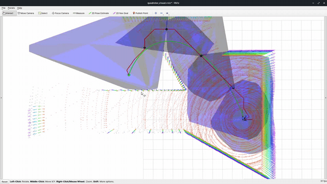
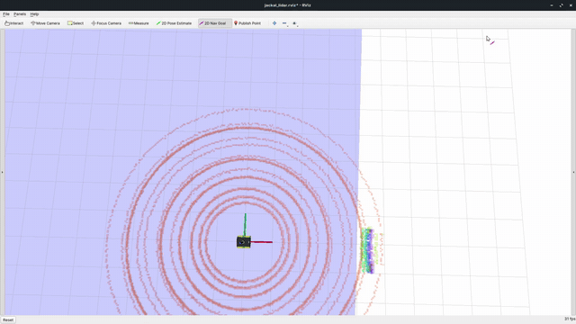

# PathCover

<!-- 


<sub>Looped previews: [quadrotor](media/simulation_drone.gif) · [Jackal](media/simulation_jackal.gif)</sub> -->
<p align="center">
  
  
</p>


**PathCover** is developed in order to enable fast convex decomposition along a path, at sensor frequency, directly on point clouds. At its core is **RISP** (Randomized Iterative Space Partitioning), a fast geometric operation that replaces the optimization loop used by state of the art conventional convex decomposition methods. Around it, this repository ships everything needed to run the algorithm in closed loop: a sparse voxel mapper, a global path search, a corridor-constrained trajectory optimizer, and Gazebo examples for a quadrotor and a differential-drive wheeled robot Jackal.

__Authors__: [Kunal Sanjay Narkhede](https://github.com/kunalnk123690), Abhijeet Mangesh Kulkarni, Guoquan Huang and Ioannis Poulakakis from the Department of Mechanical Engineering, University of Delaware.


Please give us a star and cite our paper if you use this project in your research:

```bibtex
@article{pathcover,
  title  = {\texttt{PathCover}: A Fast Convex Decomposition along a Path via Randomized Iterative Space Partitioning (\texttt{RISP}) on Point Clouds},
  author = {Narkhede, Kunal Sanjay and Kulkarni Mangesh, Abhijeet and  Guoquan, Huang and Poulakakis, Ioannis},
  journal = {arXiv:2608.05586},
  year   = {2026}
}
```


## Table of Contents

* [Quick Start](#1-quick-start)
* [Build without Docker](#2-build-without-docker)
* [Run](#3-run)
* [Packages](#4-packages)
* [Acknowledgements](#acknowledgements)
* [Licence](#licence)


## 1. Quick Start

Tested on Ubuntu 20.04 (ROS Noetic) with C++17. The fastest path is the bundled Docker image, which carries ROS Noetic desktop-full, Gazebo, and the CUDA toolkit — three commands from a clone to a robot flying through a corridor.

### Step 1 — build the docker image

```
git clone https://github.com/kunalnk123690/PathCover.git
cd PathCover
./run_docker.sh
```

[`run_docker.sh`](run_docker.sh) builds the image and drops you into a shell at `/home/PathCover/PathCover_ws`, with this repository mounted there and X11 forwarded so Gazebo and RViz open on your desktop. It probes for `nvidia-smi` **and** the NVIDIA container runtime, and requests a GPU only when both are present, so the same script works unchanged on a CPU-only machine. Set `INSTALL_CUDA=true|false` to force the toolkit in or out of the image regardless of the build host.

If you use VS Code, open the folder and *Reopen in Container* instead — [`.devcontainer/`](.devcontainer) sets up the same mount and X11 forwarding, and declares `hostRequirements.gpu: optional` so it attaches a GPU when one exists and starts normally when it does not.

### Step 2 — Build and launch an example

Two robots ship with the repository, each with a one-line script that builds the workspace and launches the full stack. Run it from the workspace root, inside the container:

| Robot | Command | World | Control output |
|---|---|---|---|
| Quadrotor | `./launch_sim_drone.sh` | `floorplan1_static.world` (office-like) | geometric controller, via `quadrotor_gazebo_plugin` |
| Jackal (differential drive) | `./launch_sim_jackal.sh` | `parking_lot.world` | velocity commands, via the diff-drive controller |

Each script is the same three steps — `catkin_make` with the robot selector, `source devel/setup.bash`, then `roslaunch corridor_planning corridor_generation_{drone,jackal}.launch`:

```
catkin_make -DCMAKE_POLICY_VERSION_MINIMUM=3.5 -DCMAKE_BUILD_TYPE=Release -DPATHCOVER_EXAMPLE=quadrotor
```

`PATHCOVER_EXAMPLE` (`quadrotor` or `jackal`) selects which robot description, Gazebo plugins, and corridor/trajectory parameters are built. It is a cached CMake variable, so switching robots is just running the other script — no config editing, and no need to wipe `build/`.

The first build takes a few minutes; later runs of the same script only rebuild what changed.

### Step 3 — Send it a goal

Gazebo and RViz come up with the world, the robot, and the mapper already running. Pick a destination with RViz's **2D Nav Goal** tool (published on `/move_base_simple/goal`) and the robot plans and drives to it: the corridor is drawn in blue, the reference path in red, and the optimized trajectory in green, all regenerated from scratch on every scan. A sample run is in the [GIF](media/simulation_drone.gif) at the top of this page.

### Other worlds

The Jackal launch file takes a `world_name` argument, and [`jackal_description/worlds/`](src/jackal_description/worlds) bundles several (`office.world`, `jackal_race.world`, `willow_garage.world`, `random_*.world`, …). Build once with the script, then launch directly:

```
source devel/setup.bash
roslaunch corridor_planning corridor_generation_jackal.launch \
  world_name:=$(rospack find jackal_description)/worlds/office.world
```

The quadrotor world is fixed inside [`corridor_generation_drone.launch`](src/corridor_planning/launch/corridor_generation_drone.launch#L8) — edit that line to change it.


## 2. Build without Docker

### Prerequisites

Ubuntu 20.04 with ROS Noetic. We use [__Eigen__](https://eigen.tuxfamily.org/) for linear algebra throughout, [__Qhull__](http://www.qhull.org/) (vendored) for convex hulls in the dual space, and __Gazebo__ with the __velodyne_simulator__ plugins for the simulated VLP-16:

```
sudo apt install ros-noetic-desktop-full ros-noetic-message-filters \
                 ros-noetic-gazebo-ros ros-noetic-velodyne ros-noetic-velodyne-simulator \
                 ros-noetic-controller-manager ros-noetic-twist-mux \
                 ros-noetic-interactive-marker-twist-server \
                 ros-noetic-joint-state-controller ros-noetic-diff-drive-controller \
                 libeigen3-dev libcdd-dev build-essential
```

### Build

```
  git clone https://github.com/kunalnk123690/PathCover.git
  cd PathCover/
  catkin_make -DCMAKE_POLICY_VERSION_MINIMUM=3.5 -DCMAKE_BUILD_TYPE=Release
```

### GPU acceleration (optional)

CUDA is __optional and affects `nanovoxmap` only__ — corridor generation is CPU-only by design. If `nvcc` is on `PATH`, the GPU raycast + ESDF kernels are compiled in; otherwise the build falls back to CPU with no source changes. At runtime the node falls back again if no device is visible, so a GPU-enabled build still runs on a CPU-only host. Confirm which path you got from the configure log:

```
-- nanovoxmap: CUDA compiler found, building GPU-accelerated raycast
```

For installation of CUDA, please go to [CUDA ToolKit](https://developer.nvidia.com/cuda-toolkit).


## 3. Run

Build the workspace, source it, and launch the whole system:

```
  catkin_make -DCMAKE_POLICY_VERSION_MINIMUM=3.5 -DCMAKE_BUILD_TYPE=Release -DPATHCOVER_EXAMPLE=quadrotor
  source devel/setup.bash
  roslaunch corridor_planning corridor_generation_drone.launch
```

The three commands above are exactly what [`launch_sim_drone.sh`](launch_sim_drone.sh) runs, so `./launch_sim_drone.sh` is equivalent. [`launch_sim_jackal.sh`](launch_sim_jackal.sh) is the same flow with `-DPATHCOVER_EXAMPLE=jackal` and `corridor_generation_jackal.launch`.

This brings up Gazebo, the quadrotor, the mapper, corridor generation, the trajectory optimizer, and RViz. At this time, you can trigger the planner using the ```2D Nav Goal``` tool (published on `/move_base_simple/goal`). When a point is clicked in ```Rviz```, the corridor (blue), the reference path (red), and the optimized trajectory (green) are regenerated from scratch on every scan. The mapper's ESDF is published on `/nanovoxmap/esdf` — colour by `intensity` in RViz to inspect it.

Related algorithms are detailed in [this paper](https://arxiv.org/abs/2608.05586).

For setup problems, like compilation errors caused by different versions of ROS/Eigen, please first refer to existing __issues__, __pull requests__, and __Google__ before raising a new issue.


## 4. Packages

All algorithms, parameters, ROS interfaces, and instructions for using PathCover in your own project are documented in the per-package READMEs:

| Package | Contents |
|---|---|
| [__corridor_planning__](src/corridor_planning) | __The core contribution.__ Header-only [RISP + PathCover](src/corridor_planning/include/planner/PathCover.hpp), the JPS/DMP front end, the ROS node, and RViz visualization. The system-level launch file and the planning parameters live here. See its [README](src/corridor_planning/README.md) |
| [__nanovoxmap__](src/nanovoxmap) | Online mapping: an unbounded sparse log-odds voxel map with an incremental signed ESDF and an optional CUDA backend. See its [README](src/nanovoxmap/README.md) |
| [__trajectory_server__](src/trajectory_server) | Receding-horizon trajectory optimizer. GCOPTER/MINCO over the corridor, with a generalized min-jerk (degree 5) / min-snap (degree 7) solver. See its [README](src/trajectory_server/README.md) |
| [__polytope_msgs__](src/polytope_msgs) | `Polytope` (`A`, `b`, `seed`) and `Polytopes` (corridor + goal) messages — the interface between corridor generation and any downstream planner. See its [README](src/polytope_msgs/README.md) |
| [__quadrotor_sim__](src/quadrotor_sim) | The test vehicle: a URDF with a VLP-16 lidar, a geometric controller plugin, ground-truth odometry, and the office-like world it flies in. See its [README](src/quadrotor_sim/README.md) |
| [__jackal_description__](src/jackal_description) | The differential-drive example: Jackal URDF, controllers, sensors, ground-truth TF/odometry, RViz setup, and the bundled Gazebo worlds. See its [README](src/jackal_description/README.md) |
| [__third_party__](src/third_party) | [JPS3D + distance-map planner](src/third_party/jps_lib) for the global path search, and [Qhull](src/third_party/qhull_lib) for dual-space redundancy removal. See its [README](src/third_party/README.md) |

To use PathCover in your own project, start with [corridor_planning](src/corridor_planning/README.md#library-usage) — RISP and PathCover are header-only, ROS-free, and templated on scalar type and dimension, needing only Eigen and Qhull. To keep the corridor generator but replace everything downstream, subscribe to `/quadrotor/polytopes` and see [polytope_msgs](src/polytope_msgs/README.md).


## Acknowledgements

This project stands on a number of open-source works. Their licenses are retained in full at the paths listed below and govern those files; the repository's own BSD 3-Clause grant does not extend to them.

### Bundled code

| Component | Author | Used for | License |
|---|---|---|---|
| [GCOPTER / MINCO](https://github.com/ZJU-FAST-Lab/GCOPTER) — `trajectory_server/include/gcopter/` | Zhepei Wang, Fei Gao (ZJU FAST Lab) | The corridor-constrained trajectory optimizer, and the L-BFGS, flatness, and geometry utilities around it | MIT — [`LICENSE.GCOPTER`](src/trajectory_server/LICENSE.GCOPTER) |
| [JPS3D + distance-map planner](https://github.com/KumarRobotics/jps3d) — `third_party/jps_lib` | Sikang Liu (KumarRobotics) | The global path search feeding PathCover | BSD 3-Clause — [`LICENSE`](src/third_party/jps_lib/LICENSE) |
| [Qhull](http://www.qhull.org/) — `third_party/qhull_lib` | C. B. Barber, D. P. Dobkin, H. Huhdanpaa | Convex hulls in the dual space, for RISP's redundant-constraint removal | [Qhull License](http://www.qhull.org/COPYING.txt) |
| Jackal description and simulation package — `jackal_description/` | Supplied package notice: Clearpath Robotics Inc. | Jackal URDF, meshes, controllers, TF/odometry helper, RViz configuration, and worlds | BSD 3-Clause, with sensor-mesh exceptions below — [`LICENSE`](src/jackal_description/LICENSE) |

### Bundled assets

| Asset | Author | Used for | License |
|---|---|---|---|
| Gazebo world — `quadrotor_description/worlds/floorplan1/` | Zhefan Xu, [uav_simulator](https://github.com/Zhefan-Xu/uav_simulator) | The office-like environment the quadrotor flies in | MIT — [`LICENSE.uav_simulator`](src/quadrotor_sim/quadrotor_description/worlds/floorplan1/LICENSE.uav_simulator) |
| VLP-16 meshes in the quadrotor and Jackal packages | Dataspeed Inc., [velodyne_simulator](https://github.com/lmark1/velodyne_simulator) | Visual model of the lidar on both robots | BSD — [`LICENSE.velodyne_simulator`](LICENSE.velodyne_simulator) |
| D435 meshes in the quadrotor and Jackal packages | Intel Corporation and contributors, [realsense-ros](https://github.com/IntelRealSense/realsense-ros) | Visual model of the optional depth camera | Apache-2.0 — [`LICENSE.realsense2_description`](LICENSE.realsense2_description) |

Except for the world and sensor meshes identified above, `quadrotor_sim` — including its
URDF/xacro descriptions, geometric controller and model plugin, ground-truth odometry node, and
RViz configuration — is original work under this repository's license.

The imported `jackal_description` package retains Clearpath Robotics' BSD 3-Clause notice. Local
PathCover integration outside that package remains covered by the repository license.

### Runtime dependencies

Not vendored here; installed from apt and used through their public interfaces.

- __[ROS Noetic](https://wiki.ros.org/noetic)__ and __[Gazebo](https://classic.gazebosim.org/)__ — the middleware and simulator the whole stack runs on.
- __[velodyne_simulator](https://github.com/lmark1/velodyne_simulator)__ (`libgazebo_ros_velodyne_laser.so`) — simulates the VLP-16 returns that drive every replanning cycle.
- __[gazebo_ros_pkgs](https://github.com/ros-simulation/gazebo_ros_pkgs)__ — model spawning, and the camera/depth plugins used by the optional sensor xacros.
- __[hector_gazebo_plugins](https://github.com/tu-darmstadt-ros-pkg/hector_gazebo)__ — IMU simulation, needed only if you re-enable [`imu.xacro`](src/quadrotor_sim/quadrotor_description/urdf/imu.xacro).
- __[Eigen](https://eigen.tuxfamily.org/)__ — linear algebra throughout.
- __[CUDA Toolkit](https://developer.nvidia.com/cuda-toolkit)__ — optional; `nanovoxmap`'s GPU raycast and ESDF kernels only.


## Licence

The source code is released under the [BSD 3-Clause](LICENSE) license.

Copyright (c) 2026 Kunal Sanjay Narkhede, Department of Mechanical Engineering, University of Delaware.

Bundled third-party code and assets keep their own terms — see [Acknowledgements](#acknowledgements) above and the third-party section of [`LICENSE`](LICENSE).
