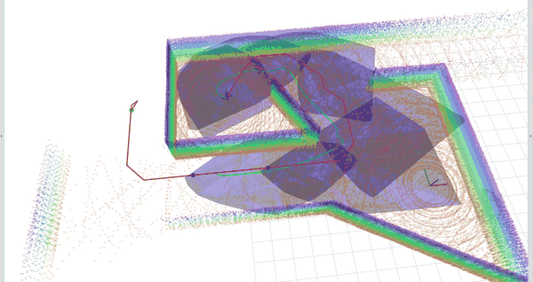
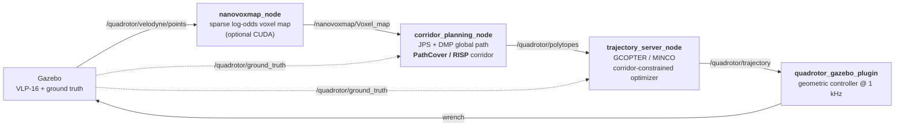

# PathCover

**Fast convex decomposition along a path via Randomized Iterative Space Partitioning (RISP), with a complete online receding-horizon planning stack.**



*Online replanning in the bundled `floorplan1` world. The sparse voxel map (rainbow) builds
from LiDAR as the quadrotor flies; PathCover regenerates the convex corridor (blue
polytopes) from scratch on every scan, and the optimizer solves for a trajectory (green)
through it along the reference path (red).*

This repository implements **RISP** and **PathCover**, plus everything needed to run them in
closed loop: a sparse voxel mapper, a global path search, a corridor-constrained trajectory
optimizer, and a Gazebo quadrotor with a geometric controller.

The core idea is a single, cheap geometric operation instead of an optimization loop. To
build an obstacle-free convex polytope around a seed point, **RISP** repeatedly samples a
random obstacle point, cuts a separating hyperplane between it and the seed, and discards
every point on the far side. Because each cut typically eliminates a whole neighbourhood of
a structured (locally coplanar) LiDAR cloud, the point set decays geometrically and the
construction runs in **expected `O(n)`** time. **PathCover** chains RISP calls along a
reference path to produce a sequence of overlapping polytopes that covers the path in
finitely many steps.

Predictable, sensor-rate corridor generation is the point: the corridor is regenerated from
scratch on *every* LiDAR scan, and the downstream planner treats it as a time-varying
constraint set.

---

## Table of contents

- [Pipeline](#pipeline)
- [The algorithms](#the-algorithms)
- [Repository layout](#repository-layout)
- [Getting started](#getting-started)
- [Running the simulation](#running-the-simulation)
- [Configuration](#configuration)
- [ROS interface](#ros-interface)
- [Using RISP / PathCover as a library](#using-risp--pathcover-as-a-library)
- [Credits](#credits)
- [License](#license)
- [Citing this work](#citing-this-work)

---

## Pipeline

Every incoming scan drives one full replanning cycle. Nothing is cached between cycles
except the occupancy map itself — the path, the corridor, and the trajectory are all
recomputed.



Per cycle, `corridor_planning_node`:

1. Converts the latest voxel map to an Eigen point cloud, dropping returns within
   `FilterRadius` (in XY) of the robot so the seed stays strictly interior.
2. Rasterizes it into a fixed-extent occupancy grid and runs **JPS** followed by a
   **distance-map planner (DMP)** refinement to get a collision-free reference path.
3. Runs **PathCover** from the robot's position along that path, capped at `horizon`
   polytopes (`max_iter` — the receding-horizon knob).
4. Publishes the corridor as `polytope_msgs/Polytopes` (an `A`, `b`, `seed` triple per
   polytope) plus RViz meshes and timing diagnostics.

The planner runs on a dedicated thread with **process-latest, drop-stale** semantics: the
subscriber callback only stashes the newest cloud, so a slow cycle never backs up a queue
or inflates end-to-end latency.

## The algorithms

### RISP — [`PathCover.hpp:85`](src/corridor_planning/include/planner/PathCover.hpp#L85)

Given a seed $y_{\text{seed}}$ in free space and a point cloud $\mathcal{P}$, repeat until
$\mathcal{P}$ is empty: sample $p \in \mathcal{P}$ uniformly, form the half-space

$$a = p - y_{\text{seed}}, \qquad b = a^\top y_{\text{seed}} + (1-\alpha)\lVert a \rVert_2^2$$

and discard every $q$ with $a^\top q > b$. The plane passes through
$\alpha y_{\text{seed}} + (1-\alpha)p$, so it strictly separates $p$ from the open ball of
radius $(1-\alpha)\lVert a \rVert_2$ around the seed — which is what guarantees the seed
stays interior and, since the sampled point itself is always eliminated, that the loop
terminates. Workspace bounds are appended, and redundant half-spaces are removed by mapping
each constraint to a dual point $d_m = a_m / (b_m - a_m^\top y_{\text{seed}})$ and keeping
only those on the Qhull convex hull.

$\alpha \in (0,1)$ trades polytope size against margin: smaller $\alpha$ gives a larger
polytope with less clearance around the seed. It defaults to `0.01` and is a function
argument, not a ROS parameter.

**Complexity.** Expected `O(n)`, worst case `O(n²)`. The expected bound holds whenever a
uniformly sampled point eliminates at least a $\beta$ fraction of the remaining points with
probability at least $r$; the `O(n²)` case requires a contrived geometry in which every
sample eliminates only itself.

The per-iteration remaining-point counts are published on
`/benchmark/remaining_points` so this decay can be measured directly from a running system.

### PathCover — [`PathCover.hpp:192`](src/corridor_planning/include/planner/PathCover.hpp#L192)

Seed RISP at the path start. Walk the waypoints: any waypoint already inside the current
polytope is skipped (one polytope may span many segments); the first one outside triggers a
new RISP call seeded at the intersection of the current polytope's boundary with the segment
leading to it. This is what decouples the polytope count from the path resolution: methods
that emit one polytope per path segment by construction produce many more of them, and every
extra polytope enlarges the constraint set handed to the optimizer.

Termination in finitely many polytopes, with all three path-coverage conditions (strict
separation, sequential intersection, full coverage), is guaranteed under mild clearance
assumptions.

## Repository layout

| Package | What it is |
|---|---|
| [`corridor_planning`](src/corridor_planning) | **The core contribution.** Header-only [RISP + PathCover](src/corridor_planning/include/planner/PathCover.hpp), the JPS/DMP front end, the ROS node, and RViz visualization |
| [`nanovoxmap`](src/nanovoxmap) | Unbounded sparse log-odds voxel map with an incremental signed ESDF and an optional CUDA backend. See its [README](src/nanovoxmap/README.md) |
| [`trajectory_server`](src/trajectory_server) | Receding-horizon trajectory optimizer: GCOPTER/MINCO over the corridor, with a generalized min-jerk (degree 5) / min-snap (degree 7) solver |
| [`polytope_msgs`](src/polytope_msgs) | `Polytope` (`A`, `b`, `seed`) and `Polytopes` (corridor + goal) messages — the interface between corridor generation and any downstream planner |
| [`quadrotor_sim`](src/quadrotor_sim) | Gazebo quadrotor simulator: URDF with a VLP-16 lidar (depth-camera and IMU descriptions ship alongside it but are commented out), geometric controller plugin, ground-truth odometry, and the static office-like world it flies in |
| [`third_party/jps_lib`](src/third_party/jps_lib) | JPS3D + distance-map planner (from [sikang/jps3d](https://github.com/KumarRobotics/jps3d)) |
| [`third_party/qhull_lib`](src/third_party/qhull_lib) | Qhull, used for dual-space redundancy removal |

## Getting started

The stack targets **ROS Noetic on Ubuntu 20.04**, C++17, and builds with `catkin_make`.

### Docker (recommended)

The bundled image carries ROS Noetic desktop-full, Gazebo, and the CUDA toolkit. GPU support
is detected, not required — see [CUDA](#cuda) below.

```sh
git clone <your-fork-url> RHP && cd RHP
./run_docker.sh          # builds the image and drops you in a shell at the workspace
```

Inside the container:

```sh
./launch_sim.sh          # catkin_make + roslaunch, all in one
```

`run_docker.sh` probes for `nvidia-smi` and the NVIDIA container runtime and only requests a
GPU when both are present, so the same script works on a CPU-only machine. Set
`INSTALL_CUDA=true|false` to force the toolkit in or out of the image regardless of the
build host.

### VS Code dev container

Open the folder and *Reopen in Container* — [`.devcontainer/`](.devcontainer) mounts the
workspace at `/home/quadrotor/quadrotor_ws`, forwards X11, and declares
`hostRequirements.gpu: optional` so it attaches a GPU when one exists and starts normally
when it does not.

### Native build

```sh
sudo apt install ros-noetic-desktop-full ros-noetic-message-filters \
                 ros-noetic-gazebo-ros ros-noetic-velodyne ros-noetic-velodyne-simulator \
                 libeigen3-dev libcdd-dev build-essential

catkin_make -DCMAKE_POLICY_VERSION_MINIMUM=3.5 -DCMAKE_BUILD_TYPE=Release
source devel/setup.bash
```

### CUDA

CUDA is **optional and affects `nanovoxmap` only** — corridor generation is CPU-only by
design. If `nvcc` is on `PATH`, `check_language(CUDA)` picks it up and the GPU
raycast + ESDF kernels are compiled in; otherwise the build falls back to CPU with no source
changes. At runtime the node falls back again if no device is visible, so a GPU-enabled build
still runs on a CPU-only host.

Confirm which path you got from the configure log:

```
-- nanovoxmap: CUDA compiler found, building GPU-accelerated raycast
```

## Running the simulation

```sh
./launch_sim.sh
```

which is equivalent to:

```sh
catkin_make -DCMAKE_POLICY_VERSION_MINIMUM=3.5 -DCMAKE_BUILD_TYPE=Release
source devel/setup.bash
roslaunch corridor_planning corridor_generation.launch
```

This brings up Gazebo, the quadrotor, the mapper, corridor generation, the trajectory
optimizer, and RViz. **Set a goal with the RViz *2D Nav Goal* tool** (published on
`/move_base_simple/goal`); `GoalPose` in the config is only the initial value. The corridor
(blue), the reference path (red), and the optimized trajectory update on every scan.

The bundled world is
[`floorplan1_static.world`](src/quadrotor_sim/quadrotor_description/worlds/floorplan1/floorplan1_static.world)
— a static 40 × 20 m office-like space of walls and box obstacles forming narrow passages
and dead ends. To fly a different one, drop it in
[`quadrotor_description/worlds/`](src/quadrotor_sim/quadrotor_description/worlds), point
`world_name` in
[`corridor_generation.launch`](src/corridor_planning/launch/corridor_generation.launch) at it,
and update
[`global_planning.yaml`](src/corridor_planning/config/global_planning.yaml) to match — the
search-grid bounds and resolution are per-world.

The mapper's ESDF is published on `/nanovoxmap/esdf` — colour by `intensity` in RViz to
inspect it.

## Configuration

### Corridor generation — [`global_planning.yaml`](src/corridor_planning/config/global_planning.yaml)

| Parameter | Meaning |
|---|---|
| `MapTopic` | Input occupied-voxel cloud (default: `nanovoxmap`'s output) |
| `GroundTruthTopic` | Robot odometry; supplies the corridor's start point |
| `VoxelResolution` | Cell size of the JPS/DMP search grid, in metres. **Not** the map resolution |
| `MapLowerBound` / `MapUpperBound` | Search-grid extent *and* the workspace bounds appended to every polytope. Per-world |
| `InitialPose` / `GoalPose` | Start, and the initial goal before an RViz nav goal arrives |
| `horizon` | **`max_iter`** — caps how far the corridor extends per cycle. `6` is the default for this quadrotor demo; `1` gives a single look-ahead polytope per cycle |
| `FilterRadius` | Discard cloud points within this XY radius of the robot. Guards the seed's interiority against self-returns |
| `DeflationFactor` | Shrink every half-space inward by this many metres (robot radius / safety margin). `0` disables |
| `DmPotentialRadius`, `DmPSearchRadius` | Distance-map planner potential and search radii |

RISP's $\alpha$ is not exposed here; it defaults to `0.01` in
[`PathCover.hpp`](src/corridor_planning/include/planner/PathCover.hpp#L94).

### Trajectory optimization — [`gcopter_params.yaml`](src/trajectory_server/config/gcopter_params.yaml)

Dynamic limits (`v_max`, `omg_max`, `theta_max`, `thrust_min/max`), penalty weights, vehicle
mass and drag, MINCO settings (`length_per_piece`, `integral_resolution`, `weight_time`),
and:

| Parameter | Meaning |
|---|---|
| `cost_order` | `3` = min-jerk, degree-5 pieces (default); `4` = min-snap, degree-7 |
| `SafetyMargin` | Additional inward shrink of each corridor half-space before optimization |
| `ReplanPeriod` | Seconds between replans |
| `GoalReachedThreshold` | Goal tolerance, in metres |

### Mapping — [`mapping.yaml`](src/nanovoxmap/config/mapping.yaml)

`VoxelResolution`, `MaxRayLength`, the log-odds model, and the ESDF band. Fully documented
in the [nanovoxmap README](src/nanovoxmap/README.md).

## ROS interface

### `corridor_planning_node`

| Direction | Topic | Type |
|---|---|---|
| sub | `MapTopic` (`/nanovoxmap/Voxel_map`) | `sensor_msgs/PointCloud2` |
| sub | `GroundTruthTopic` (`/quadrotor/ground_truth`) | `nav_msgs/Odometry` |
| sub | `/move_base_simple/goal` | `geometry_msgs/PoseStamped` |
| pub | `/quadrotor/polytopes` | `polytope_msgs/Polytopes` |
| pub | `/Polyhedra/mesh`, `/Polyhedra/edge` | RViz corridor visualization |
| pub | `/benchmark/computation_time_ms` | `std_msgs/Float64` — PathCover time in isolation |
| pub | `/benchmark/remaining_points` | `std_msgs/Int64MultiArray` — per-iteration $N_m$ decay |

### `trajectory_server_node`

| Direction | Topic | Type |
|---|---|---|
| sub | `/quadrotor/polytopes` | `polytope_msgs/Polytopes` |
| sub | `/quadrotor/ground_truth` | `nav_msgs/Odometry` |
| pub | `/quadrotor/trajectory` | `quadrotor_msgs/TrajectoryCommand` (position → snap, yaw, yaw rate) |
| pub | `/colored_trajectory` | `nav_msgs/Path` |

`polytope_msgs/Polytopes` is the integration point for a different downstream planner: each
`Polytope` is a flattened row-major `A`, an offset vector `b` (the half-space set
$\{y : Ay \le b\}$), and the `seed` that generated it.

## Using RISP / PathCover as a library

Both are header-only, ROS-free, and templated on scalar type and dimension (2-D and 3-D) —
[`PathCover.hpp`](src/corridor_planning/include/planner/PathCover.hpp) needs only Eigen and
Qhull.

```cpp
#include "planner/PathCover.hpp"

// Workspace bounds, as half-spaces A_bound * y <= b_bound.
Eigen::Matrix<double, -1, 3> A_bound(6, 3);
Eigen::Matrix<double, -1, 1> b_bound(6);
A_bound << -Eigen::Matrix3d::Identity(), Eigen::Matrix3d::Identity();
b_bound << 20.0, 10.0, 0.3, 20.0, 10.0, 2.2;   // -lower, then upper

// --- One polytope around a seed ---
Eigen::Matrix<double, -1, 3> A;
Eigen::Matrix<double, -1, 1> b;
std::vector<int> pts_remaining;                // N_m after each cut

PathCover::RISP<double, 3>(cloud, seed, A_bound, b_bound, A, b, pts_remaining,
                           /*offset=*/0.0, /*alpha=*/0.01);

// --- A corridor along a path ---
std::vector<Eigen::Matrix<double, -1, 3>> As;
std::vector<Eigen::Matrix<double, -1, 1>> bs;
std::vector<Eigen::Vector3d> seeds;            // one per polytope, plus the local target
std::vector<std::vector<int>> decay;

PathCover::pathCover<double, 3>(cloud, path, A_bound, b_bound, As, bs, seeds, decay,
                                /*offset=*/0.0, /*max_horizon=*/6, /*alpha=*/0.01);
```

`seeds.back()` is the local target $y_{\text{int}}$ — where the reference path exits the last
polytope. That is what the receding-horizon planner drives toward.

## Credits

This project stands on a number of open-source works. Their licenses are retained in full
at the paths listed below and govern those files; the repository's own BSD 3-Clause grant
does not extend to them.

### Bundled code

| Component | Author | Used for | License |
|---|---|---|---|
| [GCOPTER / MINCO](https://github.com/ZJU-FAST-Lab/GCOPTER) — `trajectory_server/include/gcopter/` | Zhepei Wang, Fei Gao (ZJU FAST Lab) | The corridor-constrained trajectory optimizer, and the L-BFGS, flatness, and geometry utilities around it | MIT — [`LICENSE`](src/trajectory_server/LICENSE) |
| [JPS3D + distance-map planner](https://github.com/KumarRobotics/jps3d) — `third_party/jps_lib` | Sikang Liu (KumarRobotics) | The global path search feeding PathCover | BSD 3-Clause — [`LICENSE`](src/third_party/jps_lib/LICENSE) |
| [Qhull](http://www.qhull.org/) — `third_party/qhull_lib` | C. B. Barber, D. P. Dobkin, H. Huhdanpaa | Convex hulls in the dual space, for RISP's redundant-constraint removal | [Qhull License](http://www.qhull.org/COPYING.txt) |

### Bundled assets

| Asset | Author | Used for | License |
|---|---|---|---|
| Gazebo world — `quadrotor_description/worlds/floorplan1/` | Zhefan Xu, [uav_simulator](https://github.com/Zhefan-Xu/uav_simulator) | The office-like environment the quadrotor flies in | MIT — [`LICENSE.uav_simulator`](src/quadrotor_sim/quadrotor_description/worlds/floorplan1/LICENSE.uav_simulator) |
| VLP-16 meshes — `quadrotor_description/meshes/VLP16_*.dae` | Dataspeed Inc., [velodyne_simulator](https://github.com/lmark1/velodyne_simulator) | Visual model of the lidar on the robot | BSD |

Everything else in `quadrotor_sim` — the URDF/xacro robot and sensor descriptions, the
geometric controller and model plugin, the ground-truth odometry node, and the RViz
configuration — is original work under this repository's license.

### Runtime dependencies

Not vendored here; installed from apt and used through their public interfaces.

- **[ROS Noetic](https://wiki.ros.org/noetic)** and **[Gazebo](https://classic.gazebosim.org/)** — the middleware and simulator the whole stack runs on.
- **[velodyne_simulator](https://github.com/lmark1/velodyne_simulator)** (`libgazebo_ros_velodyne_laser.so`) — simulates the VLP-16 returns that drive every replanning cycle.
- **[gazebo_ros_pkgs](https://github.com/ros-simulation/gazebo_ros_pkgs)** — model spawning, and the camera/depth plugins used by the optional sensor xacros.
- **[hector_gazebo_plugins](https://github.com/tu-darmstadt-ros-pkg/hector_gazebo)** — IMU simulation, needed only if you re-enable [`imu.xacro`](src/quadrotor_sim/quadrotor_description/urdf/imu.xacro).
- **[Eigen](https://eigen.tuxfamily.org/)** — linear algebra throughout.
- **[CUDA Toolkit](https://developer.nvidia.com/cuda-toolkit)** — optional; `nanovoxmap`'s GPU raycast and ESDF kernels only.


## License

Released under the **BSD 3-Clause License** — see [`LICENSE`](LICENSE).

Copyright (c) 2026 Kunal Sanjay Narkhede, Department of Mechanical Engineering,
University of Delaware.

Bundled third-party code and assets keep their own terms — see [Credits](#credits) above and
the third-party section of [`LICENSE`](LICENSE).

## Citing this work

If you use RISP or PathCover in your work, please cite the paper
([`RISP_final.pdf`](RISP_final.pdf)). It is currently under review in anonymized form —
update this entry on acceptance.

```bibtex
@article{pathcover,
  title  = {PathCover: A Fast Convex Decomposition along a Path via
            Randomized Iterative Space Partitioning (RISP) on Point Clouds},
  author = {TODO},
  year   = {TODO},
  note   = {Under review}
}
```
